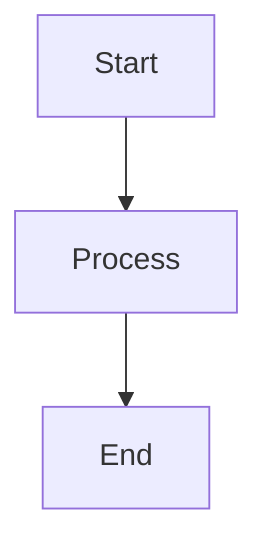

# Pale Blue Dot - Claude Reference

## Project Overview
A contemplative, local file-based knowledge manager inspired by Carl Sagan's Pale Blue Dot. Combines kanban workflow with Notion-style pages. Data stored as **single markdown files** (not folders) with YAML frontmatter.

**Tech Stack:** React 18 + TypeScript + Vite + Tauri v2 + Zustand + Tiptap

## Architecture (File-Based)
- **Dual Platform:** PWA (browser) + Tauri desktop app
- **Storage:** Browser File System Access API / Tauri FS plugin (runtime-selected via `fileSystemFactory.ts`)
- **Data Model:** Everything is a Page (`src/types/page.ts`)
- **File Structure:** One `.md` file per page (not `folder/index.md`)
- **Images:** Centralized in `workspace/.images/` with content-addressed storage
- **Page Hierarchy:** `parentId` field (not file system structure)
- **State:** Normalized Zustand store with indexes (`src/store/useStore.ts`)

### Performance Architecture (2026-03-07)
**Normalized State Store:**
- Pages stored as `Record<string, Page>` + `pageIds[]` for O(1) lookups
- Pre-built indexes: `columnIndex`, `tagIndex`, `parentIndex` for O(1) filtering
- Backward-compatible `pagesArray` getter for legacy components
- 97-99% faster derived computations (columns, tags, children)

**Optimized File I/O:**
- `updatePageMetadata()` method for metadata-only updates
- Eliminates write amplification (896.9x → near-zero for metadata changes)
- 96-98% faster metadata updates (column, tag, pin, title changes)
- Content-only updates via standard `updatePage()` method

**Scoped Event Handlers:**
- DOM handlers scoped to editor container (not document-wide)
- Early bailout for non-relevant clicks
- 24-42% faster event handling overhead

## Key Directories
```
src/
├── components/    # UI components (Layout, PageEditor, Sidebar, modals, Terminal, ToC, Memo, RecentlyEdited)
├── services/      # Business logic (fileSystem, markdown, page, image, config, migration, link, toc, graph)
├── pages/         # Route pages (Home, PageView, Settings)
├── lib/           # Utilities (slash-commands, openExternal, tiptap extensions, performance)
├── hooks/         # Custom hooks (useMarkdownShortcuts, useMermaid, usePageSelectors, useHighlightManager)
├── store/         # Zustand state (normalized store + selectors)
└── types/         # TypeScript interfaces (page, link, filter, config, fileSystem)
```

## Data Structure
```
workspace/
├── .images/           # Centralized image storage (SHA-256 content hashing)
│   ├── abc123.png
│   └── def456.png
├── .kanban-config.json # App settings (persisted)
├── Project A.md       # Root-level page
├── Task 1.md          # Child page (has parentId → Project A)
├── Task 2.md          # Child page (has parentId → Project A)
└── Notes.md           # Root-level page
```

**Page Format:**
```yaml
---
id: "uuid"                     # Required: unique identifier
title: "Page Title"            # Required: display name
parentId: "parent-page-id"     # Optional: for nested pages (creates parent-child relationship)
kanbanColumn: "To Do"          # Optional: column assignment for kanban board
tags: ["work", "urgent"]       # Optional: array of tags for filtering
dueDate: "2026-03-01"          # Optional: ISO date string
createdAt: "2026-02-21T10:00Z" # Auto: creation timestamp
updatedAt: "2026-02-21T15:30Z" # Auto: last modification timestamp
viewType: "document"           # document | kanban (future: calendar, etc.)
pinned: false                  # Optional: pin to top of column
pinnedAt: "2026-02-21T15:30Z"  # Optional: when pinned
googleCalendarEventId: "..."   # Optional: Google Calendar sync (field exists, not yet implemented)
memos:                         # Optional: reading notes and annotations
  - id: "memo-uuid"
    type: "linked"             # independent | linked
    note: "Note content"
    highlightId: "hl-uuid"     # For linked memos
    highlightText: "..."       # Reference text
    highlightColor: "#FFEB3B"
    tags: ["important"]
    createdAt: "2026-02-21T15:30Z"
    updatedAt: "2026-02-21T15:30Z"
    order: 0
---

# Page Content

Link to other pages: [[Page Title]] or [[page-id|Display Text]]
Images: 
Code blocks with syntax highlighting

Highlights are stored inline (migrated from frontmatter):
<mark data-highlight-id="hl-uuid" data-highlight-color="#FFEB3B" data-highlight-style="highlight" data-highlight-created="2026-02-21T15:30Z">highlighted text</mark>

- [ ] Interactive checkboxes
- [x] Completed items


```

## Development

### Workflow
- Main branch: `main`
- Tests: Vitest + Testing Library
- Commands: `npm run dev`, `npm run tauri:dev`, `npm test`
- Never modify git history or force push to main

### Code Style & Conventions
- TypeScript strict mode enabled
- Functional components with hooks (no class components)
- CSS modules avoided - use scoped CSS files per component
- Color values: Use CSS variables from `global.css` (e.g., `var(--accent-primary)`)
- State management: Zustand for global state, useState for local component state
- File naming: PascalCase for components, camelCase for utilities
- Imports: Absolute imports using `@/` alias

### Architecture Principles
- **Service layer separation**: All file I/O through services (pageService, imageService, etc.)
- **Platform abstraction**: fileSystemFactory.ts selects browser vs Tauri adapter at runtime
- **Single source of truth**: Page data stored in markdown files, cached in Zustand store
- **Persistent settings**: All user preferences saved to both localStorage (cache) and `.kanban-config.json` (durable)
- **External links**: Always open in system browser via `openExternalUrl()` utility
- **Type sharing with MCP server**: `mcp-pale-blue-dot-server` imports types from `src/types/page.ts`
  - ⚠️ **IMPORTANT**: When modifying `Highlight` or `Memo` types, rebuild MCP server: `cd mcp-pale-blue-dot-server && npm run build`
  - Single Source of Truth prevents type drift between frontend and MCP tools
  - No manual synchronization needed - TypeScript enforces consistency

## Important Patterns
- **Single file per page** - `Page.md` not `Page/index.md`
- **Images centralized** - All in `workspace/.images/`, not per-page folders
- **Page hierarchy via parentId** - Not file structure; sub-pages can be created via "+" button in sidebar
- **Wiki-style links** - `[[Page Title]]` or `[[id|Display]]` (see `linkService.ts`)
- **Kanban cards** - Root-level pages (no parentId) on Home board
- **Nested boards** - Pages with parentId belong to other boards
- **Column colors** - Stable color assignment based on alphabetically sorted column names (colors stay with columns when reordered)
- **Sub-page creation** - Child pages inherit parent's column by default
- **Highlight storage** - Inline `<mark>` tags in content (migrated from frontmatter)
- **Migration** - Auto-detected in Settings if old structure exists
- All file operations go through service layer abstractions
- External links open in system browser (not in-app)

## Key Services
- `pageService` - CRUD for pages, loads children by parentId, metadata-only updates, highlight migration
- `linkService` - Parse/resolve wiki links, backlinks
- `imageService` - Centralized image storage, SHA-256 hashing, deduplication
- `migrationService` - Convert old folder structure to new file structure
- `fileSystemService` - Abstraction over browser/Tauri FS APIs
- `markdownService` - Parse/render markdown with wiki link support, heading IDs
- `configService` - Manages app settings (column colors, fonts, theme, slash commands, etc.)
- `tocService` - Extract headings from markdown for Table of Contents
- `graphService` - Page relationship graph for backlinks

## Key Store Modules
- `store/useStore.ts` - Main Zustand store with normalized state
- `store/normalizedHelpers.ts` - Index management (buildNormalizedState, addPageToIndexes, updatePageInIndexes, removePageFromIndexes)
- `store/selectors.ts` - Pure selector functions for derived data (columns, tags, children, search, filter)
- `hooks/usePageSelectors.ts` - React hooks wrapping selectors (usePageById, usePagesByColumn, useChildPages, etc.)

## Features & Implementation Details

### Editor (Tiptap WYSIWYG)
- **Tiptap editor** - WYSIWYG markdown editing with tiptap-markdown
- **Feature flag** - `useWYSIWYG` setting (default: false for safe rollout)
- **Highlights & Memos** - Text highlights with colors + linked/independent memos
  - Highlights stored inline as `<mark>` tags (migrated from frontmatter)
  - Auto-migration on page load if legacy highlights detected
  - Memo types: `independent` (standalone) or `linked` (attached to highlight)
- **Wiki links** - `[[Page Title]]` or `[[id|Display]]` with autocomplete
- **Code blocks** - highlight.js syntax highlighting
- **Tables** - GFM table support (insert, edit, render)
- **Mermaid diagrams** - Flowcharts, sequence diagrams (click to zoom)
- **Images** - Paste, drag-drop, file picker → saved to `.images/` with SHA-256
- **Checkboxes** - GitHub-style interactive checkboxes
- **Slash commands** - `/` trigger for markdown snippets (customizable in Settings)
- **Find** - `Cmd/Ctrl+F` in-page search with FindBar
- **Table of Contents** - Auto-generated from headings, toggle with `Cmd+Shift+T`
- **Immerse mode** - Fullscreen focus editing (`Cmd+Shift+I`)
- **Page width** - Narrow (default, 800px) or wide (1200px) setting

### Board Views
- **Kanban board** - Drag-drop cards, reorder columns
- **List view** - Sortable table (title, column, due date, created date)
- **Compact grid** - All columns in grid layout, fits on one screen
- **Column colors** - Per-column custom colors
- **Board density** - Normal / compact layout
- **Board view persistence** - Last selected view saved in settings
- **Recently Edited** - Shows 5 most recently updated pages in Home header

### Hierarchical Pages (parentId-based)
- Pages can have a `parentId` field linking to parent page
- Sidebar displays nested tree structure with visual borders
- Sub-pages created via "+" button automatically inherit parent's column
- Expand/collapse functionality:
  - Individual: Click ▸/▾ buttons
  - Bulk: "Expand all" / "Collapse all" buttons
- State managed in `Sidebar.tsx` with `collapsedPages: Set<string>`

### Column Color System
- Custom colors stored in `columnColors: Record<string, string>` (lowercase keys)
- Fallback to `DEFAULT_PALETTE` array for columns without custom colors
- **Stable color assignment**: Colors based on alphabetically sorted column list, not display order
- Implementation: `getColumnColor(columnName)` uses `sortedColumnNames.findIndex()` for stable indexing
- Applied in: Home.tsx (kanban + list), Settings.tsx, Sidebar.tsx (tag filters)

### Sidebar Features
- **Tag filters**: Color-coded chips matching column colors (collapsible)
- **Search**: Full-text across titles and content
- **Sort**: title, createdAt, updatedAt, dueDate
- **Compact design**: Reduced padding, gaps, and sizes for space efficiency
- **Tree structure**: Visual hierarchy with left borders for nested pages
- **Expand/collapse**: Individual and bulk controls

### Settings Customization
- **Font settings**: Family (UI + content + mono), size, line height
- **Heading colors**: H1-H4 with color pickers and reset buttons
- **Column colors**: Per-column color assignment
- **Board density**: Normal vs compact layout
- **Board view**: Kanban, list, or compact grid
- **Page width**: Narrow (800px) or wide (1200px)
- **Slash commands**: Fully customizable command palette
- **WYSIWYG editor**: Feature flag to enable Tiptap editor
- **Highlight colors**: Customizable palette for text highlighting
- All settings persist to both localStorage and `.kanban-config.json`

### List View Sorting
- Sortable columns: Title, Column, Due Date, Created
- Click headers to toggle sort direction (asc/desc)
- Column sorting uses case-insensitive comparison
- Active column shows arrow indicator (↑/↓)
- Vertical scroll enabled with horizontal scroll for wide content

### Page View Features
- **Table of Contents** - Auto-extracted from headings, `Cmd+Shift+T` to toggle
- **Terminal** (Tauri only) - Embedded terminal with workspace cwd
- **Memo panel** - Resizable panel for reading notes and annotations
- **Immerse mode** - Hide all UI chrome, `Cmd+Shift+I` to toggle, `Esc` to exit
- **Scroll to top** - Button appears on scroll, click to return to top
- **Page menu** - Column, tags, due date inline editing
- **Backlinks** - Show pages that link to current page

### Terminal Feature (Tauri Desktop Only)
- **Embedded terminal** - Full xterm.js terminal in page view
- **Working directory** - Opens in workspace root
- **Keyboard shortcut** - `` Cmd+` `` to toggle
- **Implementation** - `src/components/Terminal.tsx`
- **Backend** - Tauri Rust plugin for PTY session management

### Table of Contents Feature
- **Auto-generation** - Extracts h1-h6 from markdown
- **Hierarchical display** - Visual indentation for heading levels
- **Quick navigation** - Click to scroll to section
- **Keyboard shortcut** - `Cmd+Shift+T` to toggle
- **Smart hiding** - Hidden in edit mode and immerse mode
- **Implementation** - `src/services/tocService.ts`, `src/components/TocPanel.tsx`
- See `docs/TOC_FEATURE.md` for detailed documentation

### Highlight & Memo System
- **Highlight storage** - Inline `<mark>` tags in content (v2 migration)
- **Auto-migration** - Legacy frontmatter highlights converted on page load
- **Memo types**:
  - `independent` - Standalone reading notes
  - `linked` - Attached to specific highlight
- **Memo panel** - Resizable sidebar for memo management
- **Bubble menu** - Quick highlight creation on text selection
- **Color picker** - Customizable highlight colors in Settings
- **MCP integration** - AI agents can manage highlights/memos via MCP server

### MCP Server Integration
- **Server name**: `pbd` (renamed from `pale-blue-dot`)
- **Location**: `mcp-pale-blue-dot-server/`
- **Type sharing**: Imports types from `src/types/page.ts` (Single Source of Truth)
- **Features**:
  - Page CRUD operations
  - Highlight management
  - Memo management
  - Image OCR and analysis
  - Section editing
- **Setup**: See `mcp-pale-blue-dot-server/README.md`
- ⚠️ **Important**: Rebuild after type changes: `cd mcp-pale-blue-dot-server && npm run build`

## Common Patterns & Solutions

### Adding a new sortable field
1. Add to type: Update `listSortField` type in `Home.tsx`
2. Add UI: Add clickable header in list view JSX
3. Update sort logic: Handle new field in sort comparator (use lowercase for case-insensitive)

### Adding a new setting
1. Define type in `configService.ts` (`KanbanSettings` interface)
2. Add default value in `DEFAULT_SETTINGS`
3. Add to store in `useStore.ts` (state + setter)
4. Add UI in `Settings.tsx`
5. Settings auto-persist to both localStorage and `.kanban-config.json`

### Working with colors
- Always use CSS variables from `global.css` (e.g., `var(--text-primary)`)
- For column/tag colors: Use `getColumnColor(name)` pattern with stable index
- Default palette: `DEFAULT_PALETTE` array (8 colors, cycles with modulo)
- Custom colors: Stored in `columnColors` record (lowercase keys)

### File system operations
- Never call browser/Tauri APIs directly
- Always use `fileSystemService` abstraction
- For images: Use `imageService` (handles content hashing, deduplication)
- For pages: Use `pageService` (handles YAML frontmatter, file naming)
- **Metadata-only updates**: Use `pageService.updatePageMetadata(path, { field: value })` for column, tag, pin, title changes
- **Content updates**: Use `pageService.updatePage(page)` when content changes

### Performance patterns
**State access:**
- Use selectors from `src/store/selectors.ts` for derived data
- Use hooks from `src/hooks/usePageSelectors.ts` in components
- Access `pagesArray` for backward compatibility, not `pages` directly
- Indexes (`columnIndex`, `tagIndex`, `parentIndex`) are updated incrementally

**Avoiding re-renders:**
- Selectors automatically memoize results
- Use `usePageById(id)` instead of `pages.find(p => p.id === id)`
- Use `usePagesByColumn(col)` instead of filtering in component
- Use `useChildPages(parentId)` for O(1) child lookup

**File I/O optimization:**
- Prefer `updatePageMetadata()` over `updatePage()` when only metadata changes
- Batch multiple metadata updates when possible
- Content updates always require full file write (markdown format limitation)

### Debugging tips
- Check browser console for File System Access API errors
- Verify `.kanban-config.json` for setting persistence issues
- Check `workspace/.images/` for image storage problems
- Use React DevTools to inspect Zustand store state
- Tauri console: `npm run tauri:dev` shows both frontend and backend logs

## Keyboard Shortcuts

### Global
- `E` - Enter edit mode (PageView)
- `Escape` - Exit edit/immerse mode
- `Cmd/Ctrl+S` - Save current page
- `Cmd/Ctrl+F` - Find in page
- `Cmd/Ctrl+=` - Zoom in (desktop)
- `Cmd/Ctrl+-` - Zoom out (desktop)
- `Cmd/Ctrl+0` - Reset zoom (desktop)

### Editor
- `Cmd/Ctrl+B` - Bold
- `Cmd/Ctrl+I` - Italic
- `Cmd/Ctrl+E` - Inline code
- `Tab` - Indent
- `Shift+Tab` - Outdent
- `/` - Slash command palette

### Page View
- `Cmd/Ctrl+Shift+T` - Toggle Table of Contents
- `Cmd/Ctrl+Shift+I` - Toggle immerse mode
- `` Cmd/Ctrl+` `` - Toggle terminal (Tauri only)

## Migration Notes

### Workspace Template (OUTDATED)
- **Note**: `workspace-template/` still uses old folder structure (`folder/index.md`)
- **Current app** uses single-file structure (`Page.md`)
- Migration tool available in Settings for existing users
- Template will be updated in future release

### Highlight Storage Migration
- **Old**: Highlights stored in YAML frontmatter with `from`/`to` offsets
- **New**: Inline `<mark>` tags in content
- **Auto-migration**: Runs on page load if legacy highlights detected
- **Benefits**: Stable, portable, survives content edits better

## Known Issues & Limitations
- Workspace template needs update to single-file structure
- Google Calendar sync field exists but integration not implemented
- Terminal feature only available in Tauri desktop app
- Mermaid diagram zoom modal requires manual close (no Escape key)

## Future Enhancements
- Google Calendar integration
- Active heading highlighting (scroll spy) in ToC
- Resizable ToC panel
- ToC search/filter
- Mobile app support
- Real-time collaboration
- Plugin system

## Agentic Workflow (harness pattern)

이 저장소는 [Chachamaru127/claude-code-harness](https://github.com/Chachamaru127/claude-code-harness) 의 Plan→Work→Review 사이클을 1인 프로젝트에 맞게 축소·한국어화 한 구조를 갖는다.

### 작업 사이클

1. **Plan**: `/pbd-plan add "T<n>: 요약 (DoD: 기준)"` — [Plans.md](Plans.md) 에 task 등록 (`pm:요청` 마커)
2. **Work**: `/pbd-work T<n>` — worker agent 가 git worktree 격리에서 구현·검증·worker-report.v1 작성 (`cc:진행` → `cc:완료`)
3. **Review**: `/pbd-review code` — reviewer agent (context fork 격리) 가 DoD/회귀/안티패턴 검증 후 verdict 반환
4. **Confirm**: 사용자가 `/pbd-plan update T<n> --status pm:확인`
5. **Release**: `/release-build` — 기존 release skill

### SSoT (Single Source of Truth)

**모든 자동화 대상 작업은 [Plans.md](Plans.md) 에 등록**. 등록되지 않은 작업은 worker / reviewer 디스패치 거부. 상태 마커는 `pm:요청` → `cc:진행` → `cc:완료` → `pm:확인` 4개만 사용 (단방향 전이).

### 역할 분리

| 역할 | 위치 | 권한 | 호출 |
|------|------|------|------|
| advisor | [.claude/agents/advisor.md](.claude/agents/advisor.md) | read-only (Read/Grep/Glob) | worker 가 막힐 때 자동 |
| reviewer | [.claude/agents/reviewer.md](.claude/agents/reviewer.md) | read-only + Bash (테스트 재실행만) | `/pbd-review` |
| worker | [.claude/agents/worker.md](.claude/agents/worker.md) | worktree 격리, Edit/Write/Bash | `/pbd-work` |

### 정책 (rules/)

코드 변경에 적용되는 정책은 [.claude/rules/](.claude/rules/) 에 분리:

- [plans-management](.claude/rules/plans-management.md) — Plans.md 마커 / 전이 규칙
- [service-layer](.claude/rules/service-layer.md) — fileSystem/page/imageService 패턴, `updatePageMetadata` vs `updatePage`
- [mcp-type-sync](.claude/rules/mcp-type-sync.md) — `src/types/page.ts` 변경 시 MCP 서버 rebuild 의무
- [normalized-state](.claude/rules/normalized-state.md) — selector / hook 사용 의무, 직접 find/filter 금지
- [test-quality](.claude/rules/test-quality.md) — 통합 테스트 우선
- [commit-safety](.claude/rules/commit-safety.md) — `--no-verify`/force push 금지

### 운영 임계치

[.pbd-harness.yaml](.pbd-harness.yaml) 의 `monitor.plans_drift` (WIP 3 / stale 24h), `advisor.max_consults_per_task` (3), `worker.validation_commands` 참조.

### 출력 포맷

[.claude/output-styles/pbd-ops.md](.claude/output-styles/pbd-ops.md) 가 활성화되면 Work phase 응답은 항상 Done/Current/Next 3-section, Review phase 는 Verdict/Findings/Next action 형식.
